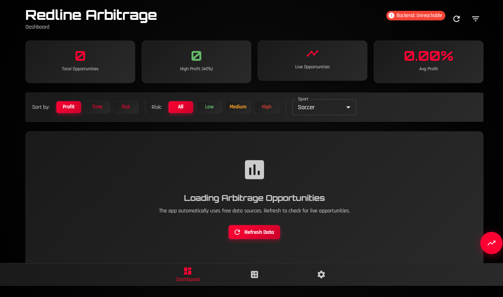
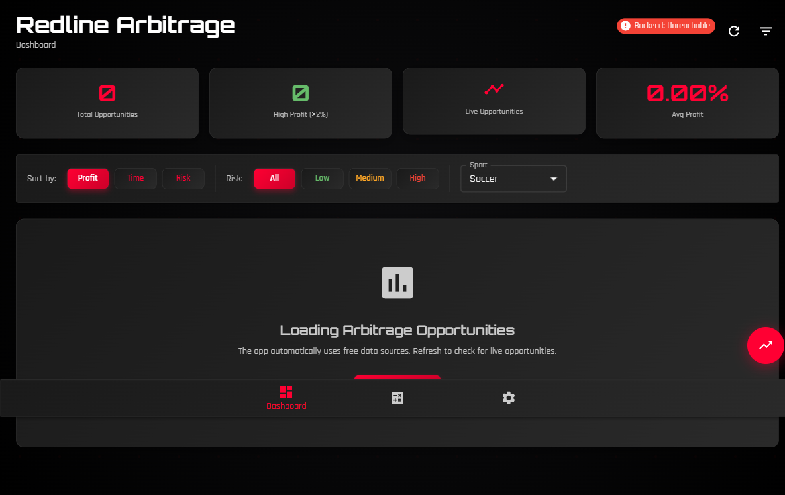

<div align="center">
  <picture>
    <source media="(prefers-color-scheme: dark)" srcset="./GitHub_README_Assets/logo_dark.svg" />
    <source media="(prefers-color-scheme: light)" srcset="./GitHub_README_Assets/logo_light.svg" />
    
  </picture>
  
  <br/>
  
  
  
  <p>
    <a href="https://github.com/Snapwave333/Redline_Arb/actions/workflows/ci.yml">
      
    </a>
    <a href="https://github.com/Snapwave333/Redline_Arb/actions/workflows/ci.yml">
      
    </a>
    
    
    
    
    
    
    <a href="https://github.com/Snapwave333/Redline_Arb/releases/tag/v1.2.1">
      
    </a>
    <a href="https://github.com/Snapwave333/Redline_Arb/releases/tag/v1.2.1">
      
    </a>
  </p>
</div>

---

# 🚀 Redline Arbitrage

> Maintenance Notice (deadline focus): Mobile web app build/test/production pipelines are temporarily paused. We are prioritizing the Desktop Client (Windows/macOS) and the Backend Flask API server. CI mobile QA has been disabled and mobile preview servers have been stopped. Existing mobile instructions remain below for reference only and will be re-enabled after deadlines.

Precision sports-arbitrage engine with a modern PyQt6 interface, tuned for performance and reliability. Built for rapid market scanning, robust account health monitoring, and one-click execution workflows. Brand-focused presentation using the Redline palette: `#FF0033` (accent), `#0D0D0F` (charcoal), `#FFFFFF` (white).

## v1.2.1 — Brief Changelog and Downloads

- Desktop GUI: backend health indicator wired by default (provider panel footer, auto-refresh)
- Backend Flask API: `.env` auto-loading via `python-dotenv` for easier Windows setup
- Documentation: Windows-friendly `.env` section added to README and backend/README.md
- New Windows artifact: Redline_Arbitrage_1.2.1_Windows_x64.zip (onedir)
  - Download: https://github.com/Snapwave333/Redline_Arb/releases/download/v1.2.1/Redline_Arbitrage_1.2.1_Windows_x64.zip
- Source bundles (Windows x86):
  - Backend: https://github.com/Snapwave333/Redline_Arb/releases/download/v1.2.1/backend_source_windows_x86.zip
  - Desktop: https://github.com/Snapwave333/Redline_Arb/releases/download/v1.2.1/desktop_source_windows_x86.zip

Full release notes: https://github.com/Snapwave333/Redline_Arb/releases/tag/v1.2.1

<details>
<summary><strong>🧭 Table of Contents</strong></summary>

- [About](#-about)
- [Features](#-features)
- [Installation](#-installation)
- [Usage](#-usage)
 - [Provider Configuration](#-provider-configuration)
 - [Build/Packaging (Windows)](#-buildpackaging-windows)
 - [Troubleshooting](#-troubleshooting)
- [Screenshots](#-screenshots)
- [Tech Stack](#-tech-stack)
- [Roadmap](#-roadmap)
- [Contributing](#-contributing)
- [License](#-license)
- [Contact](#-contact)

</details>

## 🎯 About

**ARBYS (Redline Arbitrage) is a sports arbitrage betting toolkit exclusively focused on sports markets.** This project contains **NO DeFi, cryptocurrency, blockchain, or meme coin content**. All functionality is related to legitimate sports arbitrage betting across traditional sportsbooks.

Redline Arbitrage is an arbitrage research and execution toolkit featuring:
- A performant orchestration layer to aggregate odds and metadata from multiple sources.
- A polished PyQt6 desktop UI with DPI-aware scaling and theme styling.
- Clean architecture with testing, linting, and packaging pipelines included.

The application targets sports markets, providing rapid arbitrage detection, stake calculations, and health checks across accounts to mitigate risk while maintaining speed.

### ⚠️ Project Scope
- ✅ **Sports Arbitrage**: Football, basketball, tennis, soccer, and other sports
- ✅ **Bookmaker Integration**: Bet365, William Hill, and other licensed sportsbooks
- ✅ **Odds Aggregation**: SportRadar, SofaScore, OddsAPI, and sports data providers
- ❌ **No DeFi/Crypto**: This project does not contain any blockchain or cryptocurrency functionality
- ❌ **No Meme Coins**: No token discovery, DEX integrations, or Web3 features

## 🧰 Features

- ⚡ High-performance data orchestrator (async-ready variants available)
- 📈 Arbitrage calculation and optimized stake distribution
- 🧬 Account health scoring with a dedicated dashboard
- 🧩 Modular provider interfaces (TheOddsAPI, Sportradar, and more)
- 💾 Historical data storage utilities
- 🎛️ Theming (Rajdhani + Orbitron-inspired visual style) and carbon fiber UI accents
- 🪪 First-run onboarding, splash, and setup wizard
- 🧪 Comprehensive test suite (unit, perf, integration)
- 📦 Portable build and Windows installer scripts

## 🛠 Installation

Choose one of the following:

### ⬇️ Quick Downloads (v1.1.6)

- Release page: https://github.com/Snapwave333/Redline_Arb/releases/tag/v1.1.6
- Windows Desktop:
  - Standalone EXE (onefile): [Download](https://github.com/Snapwave333/Redline_Arb/releases/download/v1.1.6/Redline_Arbitrage_1.1.6_Windows_x64_Standalone.exe) — no Python required
  - Portable ZIP (onedir): [Download](https://github.com/Snapwave333/Redline_Arb/releases/download/v1.1.6/Redline_Arbitrage_1.1.6_Windows_x64.zip) — extract and run the EXE inside
  - Guide: [INSTALL_DESKTOP_WINDOWS.md](INSTALL_DESKTOP_WINDOWS.md)
- macOS Desktop: [Download DMG](https://github.com/Snapwave333/Redline_Arb/releases/download/v1.1.6/Redline_Arbitrage_1.1.6_macOS_universal.dmg) — see [INSTALL_DESKTOP_MACOS.md](INSTALL_DESKTOP_MACOS.md)
- iPadOS/Web (PWA): [Download ZIP](https://github.com/Snapwave333/Redline_Arb/releases/download/v1.1.6/Redline_Arbitrage_1.1.6_Web.zip) — see [INSTALL_PWA.md](INSTALL_PWA.md)
- Checksums: [checksums.txt](https://github.com/Snapwave333/Redline_Arb/releases/download/v1.1.6/Redline_Arbitrage_1.1.6_checksums.txt) (SHA256 for all artifacts)
- Install guides: [Windows](INSTALL_DESKTOP_WINDOWS.md) · [macOS](INSTALL_DESKTOP_MACOS.md) · [iPadOS/Web](INSTALL_PWA.md)

### ✅ Getting Started (2‑minute setup)

- **macOS Desktop**:
- Download and mount the DMG: [Redline_Arbitrage_1.1.6_macOS_universal.dmg](https://github.com/Snapwave333/Redline_Arb/releases/download/v1.1.6/Redline_Arbitrage_1.1.6_macOS_universal.dmg)
  - Step‑by‑step guide: [INSTALL_DESKTOP_MACOS.md](INSTALL_DESKTOP_MACOS.md)

- **Windows Desktop**:
- Download and run the Standalone EXE: [Redline_Arbitrage_1.1.6_Windows_x64_Standalone.exe](https://github.com/Snapwave333/Redline_Arb/releases/download/v1.1.6/Redline_Arbitrage_1.1.6_Windows_x64_Standalone.exe)
  - Or download the Portable ZIP: [Redline_Arbitrage_1.1.6_Windows_x64.zip](https://github.com/Snapwave333/Redline_Arb/releases/download/v1.1.6/Redline_Arbitrage_1.1.6_Windows_x64.zip)
  - Step‑by‑step guide: [INSTALL_DESKTOP_WINDOWS.md](INSTALL_DESKTOP_WINDOWS.md)

- **iPadOS/Web (PWA)**:
- Download the standalone web build: [Redline_Arbitrage_1.1.6_Web.zip](https://github.com/Snapwave333/Redline_Arb/releases/download/v1.1.6/Redline_Arbitrage_1.1.6_Web.zip)
  - Install on iPadOS/Android: [INSTALL_PWA.md](INSTALL_PWA.md)

- Verify downloads: [checksums.txt](https://github.com/Snapwave333/Redline_Arb/releases/download/v1.1.6/Redline_Arbitrage_1.1.6_checksums.txt) (SHA256 for all artifacts)

### Desktop Application

1) Windows Binary (recommended)
- Standalone EXE (onefile): download `Redline_Arbitrage_<version>_Windows_x64_Standalone.exe` and run.
- Portable ZIP (onedir): download `Redline_Arbitrage_<version>_Windows_x64.zip`, extract, then run the `Redline_Arbitrage_<version>_Windows_x64.exe` inside the folder.

2) Portable ZIP
- Download `Redline_Arbitrage.zip`, extract, and run `Redline_Arbitrage.exe` inside the folder. Configuration files will be stored locally inside the `portable_data` directory.

3) From Source
- Requirements: Python 3.10+, Windows/macOS/Linux
- Clone the repo and install dependencies:

```bash
git clone https://github.com/Snapwave333/Redline_Arb.git
cd Redline_Arb
python -m venv .venv && .venv\Scripts\activate
pip install -r requirements.txt
python main.py
```

### 🔧 Environment Configuration (.env)

Both the Desktop Client and the Backend Flask API automatically load environment variables from a `.env` file via `python-dotenv`.

- Copy `env.example` to `.env` in the project root and fill in your real provider keys and backend URL.
- On Windows PowerShell, you can also set variables for the current session:

```powershell
$env:API_SPORTS_KEY   = "<your api-sports key>"
$env:THE_ODDS_API_KEY = "<your the-odds-api key>"
$env:ARBYS_BACKEND_URL = "http://localhost:5000"  # if running the local backend
```

Key entries in `.env`:
- `ARBYS_BACKEND_URL` — where the GUI looks for the backend health and opportunities (default `http://localhost:5000`)
- `API_SPORTS_KEY` — optional, enables APISportsProvider for additional sports
- `THE_ODDS_API_KEY` — optional, enables TheOddsAPIProvider for broader market coverage
- `SOFASCORE_ENABLED` — `1` by default for free SofaScore scraping (set `0` to disable)

See `env.example` for a Windows-friendly template and tips.

### 🧱 Build/Packaging (Windows)

If you want to produce a packaged Windows build (PyInstaller):

1) Use the project’s Python 3.10 virtual environment to avoid DLL mismatches

```powershell
# From the project root
.venv310\Scripts\activate
scripts\build_windows.bat
```

2) If Windows Defender flags the build during resource injection (BeginUpdateResourceW), add a temporary exclusion for the project folder, then re-run the build:

- Windows Security → Virus & threat protection → Manage settings → Add or remove exclusions → Add folder → select your ARBYS project folder
- Re-run: `scripts\build_windows.bat`

Notes:
- The build script reads version via `scripts/read_version.py` and uses `.venv310` to run PyInstaller, preventing `pythonXY.dll` conflicts.
- After a successful build, artifacts appear under `dist/`.
- If `dist/` is empty, it’s likely Defender blocked the operation. Add the exclusion and try again.

### 🌐 Mobile Web App (Browser-Based)

⚠ Maintenance Pause: The Mobile Web App runtime and CI pipelines are currently disabled to focus on desktop and backend delivery. The following instructions are retained for reference and will be reinstated post‑deadline. If you need a stable mobile/web build, use the last released artifacts from v1.1.6.

Run Redline Arbitrage directly in your browser with full offline functionality:

- **Requirements**: Node.js 18+, Python 3.8+, modern web browser
- **Platform**: iOS Safari, Android Chrome, desktop browsers
- **Storage**: All data stored locally in browser (IndexedDB)

```bash
# Start the backend API server (provides arbitrage opportunities)
python backend/api_server.py
# Server runs on http://127.0.0.1:5000
# Optional: set real provider API keys (if available) before starting:
#   PowerShell:
#   $env:THE_ODDS_API_KEY = "<your the-odds-api key>"
#   $env:API_SPORTS_KEY   = "<your api-sports key>"

# Start the mobile web app
npm install
npm run dev
# Open http://localhost:3000 in your browser
```

Note: During the maintenance pause, do not start the mobile preview or SPA servers in production environments. Desktop client builds and the backend API remain fully supported.

**Features**:
- ⚡ Full arbitrage detection and stake calculation
- 📱 Mobile-optimized responsive interface
- 🔒 Complete offline functionality
- 💾 Local data storage (no server required)
- 📲 PWA-ready for app-like experience
- 🔗 Backend API integration for live opportunities
 - 🎯 Compact sport selector (All, Soccer, Basketball, Baseball, Hockey, Tennis) with localStorage persistence

**Backend API Server** (`backend/api_server.py`):
- Flask-based REST API serving arbitrage opportunities from real provider data
- Uses MultiAPIOrchestrator with real sources only:
  - SofaScoreScraperProvider (free; enabled by default)
  - APISportsProvider (requires API key; optional)
  - TheOddsAPIProvider (requires API key; optional)
- Computes opportunities via ArbitrageDetector; strictly no synthetic/mock data
- Endpoints:
  - `GET /api/health` – server and provider status
  - `GET /api/opportunities?sport=soccer&min_profit_pct=1.0&limit=100&include_raw=false`
- CORS-enabled for browser access
- Query parameters:
  - `sport` (default `soccer`; other sports require paid providers configured)
  - `min_profit_pct` (float, default `1.0`)
  - `limit` (int, default `100`, max `500`)
  - `include_raw` (bool, default `false`) to include normalized per-provider raw data for validation

[📖 Mobile App Documentation](mobile_web_app/README.md)

PWA install guides for Android/iOS: see [INSTALL_PWA.md](INSTALL_PWA.md)

#### 🧪 Testing the Mobile Web App

From `mobile_web_app/`:

```bash
npm install
npx playwright install

# Unit & component tests with coverage
npm run test

# Production build + preview server
npm run build
npm run preview   # http://localhost:4173/

# E2E tests against preview server
npm run test:e2e

# Performance benchmarks (tagged @perf)
npm run test:perf

# View Playwright HTML report
npx playwright show-report
```

Coverage output lives at `mobile_web_app/coverage/index.html`.

## 🛡️ Quality Assurance

Redline Arbitrage maintains enterprise-grade quality standards with comprehensive automated testing:

### Testing Infrastructure
- **15+ E2E Test Files**: Complete user journey coverage across all features
- **Component Testing**: Playwright CT for isolated component validation
- **Visual Regression**: Baseline screenshots with automatic diff detection
- **Accessibility Testing**: WCAG 2.0 A/AA compliance with axe-core automation
- **Performance Budgets**: Core Web Vitals enforcement (LCP < 3s, FCP < 1.2s, CLS < 0.1)
- **Cross-Browser Testing**: Chromium, Firefox, WebKit, Mobile Safari, Mobile Chrome

### Quality Gates
- **Smoke Tests**: Critical path validation (blocks all releases)
- **Accessibility Audits**: Automated axe-core scans (blocks on violations > minor)
- **Performance Budgets**: Core Web Vitals enforcement (blocks on regressions)
- **Console Error Detection**: Zero-tolerance for JavaScript errors
- **CI/CD Integration**: GitHub Actions with comprehensive artifact collection

### Test Execution
```bash
cd mobile_web_app

# Quality gate (run first)
npm run test:smoke

# Full test suite
npm run test:e2e

# Performance validation
npm run test:perf

# Accessibility compliance
npx playwright test tests/e2e/07_accessibility.spec.ts

# View detailed reports
npx playwright show-report
```

### Release Blocking Criteria
Releases are automatically blocked if any of these conditions are met:
- ❌ Smoke test failures
- ❌ Accessibility violations > minor severity
- ❌ Performance budget breaches (LCP, FCP, CLS)
- ❌ Console errors detected
- ❌ Critical E2E test failures

All test artifacts are uploaded to CI for debugging and trend analysis.

## ▶️ Usage

- Launch the app (`Redline_Arbitrage.exe` or `python main.py`).
- Complete the onboarding flow and configure your providers in the API Provider dialog.
- Use the main window to begin scanning markets and view arbitrage opportunities.
- The tachometer widget and account health indicators guide risk decisions.

Tips:
- Configure settings in `config/settings.py`.
- First run flags live in `config/first_run_flags.json`.
- For advanced orchestration, see `src/data_orchestrator_enhanced.py`.

#### 🧪 Production Skip Mode (Onboarding suppressed)

For automated or production launches you can skip onboarding by setting:

```powershell
$env:ARBYS_SUPPRESS_WIZARD = "1"; python main.py
```

Behavior in skip mode:
- The initial odds fetch is triggered immediately when a data source exists.
- The periodic update thread/timer remains enabled so the table stays fresh.
- If the free SofaScore source is rate‑limited, you’ll see a graceful warning; configure a paid provider to restore live odds.

Quick checks:
- Use “Refresh Now” in the toolbar to force an immediate re‑fetch.
- Open Settings → API Providers to add keys for paid providers when ready.

## 🔌 Provider Configuration

Redline Arbitrage supports multiple data providers. By default, the free SofaScore Scraper is enabled. If free sources are rate-limited (e.g., 403), you can add paid providers post-production without changing source code.

You have two options to configure providers:

1) In-App (recommended)
- Open Settings → API Providers
- Add a provider (e.g., API-Sports, TheOddsAPI, Sportradar)
- Paste your API key and enable the provider
- Restart the app to apply settings

2) CLI helper
- Use the script to configure API-Sports as a backup provider and keep SofaScore as the free fallback:

```bash
python scripts/configure_api_sports.py --api-key YOUR_APISPORTS_KEY
```

This script:
- Creates/updates `config/bot_config.json` preserving existing providers
- Ensures "SofaScore Scraper" remains enabled as the highest-priority free source
- Mirrors the API key to `.env` for discoverability

Notes:
- No API keys are committed to the repository
- API-Sports free plan is 100 requests/day; a rate limiter is built in
- If you prefer not to add keys during development, the app will operate with SofaScore only. Expect occasional 403s from the free scraper; the app handles them gracefully.

## 📸 Screenshots

<div align="center">
  
</div>

Social Preview (used on repo cards):

<div align="center">
  
</div>

### Additional UI Previews

<div align="center">
  <table>
    <tr>
      <td></td>
<!-- Setup Wizard removed -->
    </tr>
    <tr>
      <td></td>
      <td></td>
    </tr>
  </table>
  <br/>
  <sub>Previews generated via <code>scripts/gui_preview_capture.py</code></sub>
  <br/>
  <sub>Run a local viewer: <code>python -m http.server 8000</code> (from the <code>previews</code> folder)</sub>
</div>

## 🧱 Tech Stack

- Python 3.10+
- PyQt6 (GUI)
- AioHTTP, Requests (data fetching)
- NumPy (analysis)
- BeautifulSoup4 (scraping)
- PyInstaller (packaging), Inno Setup (installer)
- GitHub Actions CI

## 🗺️ Roadmap

- Multi-API expansion and failover improvements
- Enhanced performance benchmarks and profiling
- Advanced error handling and state management via structured datatables/structs
- Configurable lighting/theme presets for UI polish
- Additional scrapers and data providers

See `MULTI_API_ENHANCEMENT.md`, `PERFORMANCE_OPTIMIZATION.md`, and `PHASE2_STATUS.md` for ongoing work.

## 🤝 Contributing

We welcome issues and pull requests! To contribute:

```bash
python -m pip install nox
nox  # run linting, tests, and quality checks
```

Standards:
- Formatting: Black + Isort
- Linting: Ruff
- Types: MyPy (strict mode)
- Tests: PyTest with property/perf/integration suites

## 🛠 Troubleshooting

- Empty dashboard after skipping onboarding
  - Ensure `ARBYS_SUPPRESS_WIZARD=1` and check that the log shows “initial fetch” and that the update timer is enabled
  - Click “Refresh Now” to force a re‑fetch; if using only the free SofaScore source, occasional 403s are expected
  - Configure a paid provider via Settings → API Providers for reliable live odds

- Windows packaging build produces an empty `dist/` folder
  - Windows Defender likely blocked resource injection; add a temporary exclusion for the project folder and re‑run `scripts\\build_windows.bat`

- Backend health check warnings in logs
  - These are expected in offline/dev environments for local endpoints; they do not block the GUI

## ✅ License

MIT License. See `pyproject.toml` for project metadata.

## 📬 Contact

For support or requests, open an issue on GitHub. Security concerns can be reported via private issue.

---

<div align="center">
  <picture>
    <source media="(prefers-color-scheme: dark)" srcset="./GitHub_README_Assets/logo_dark.svg" />
    <source media="(prefers-color-scheme: light)" srcset="./GitHub_README_Assets/logo_light.svg" />
    
  </picture>
  <br/>
  <sub>Built with ❤️ — Palette: #FF0033 / #0D0D0F / #FFFFFF</sub>
</div>
